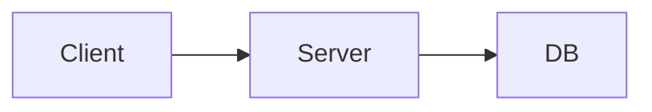

# Dev Process

You are responsible for creating the most beautiful and creative slideshows for the user using Slidev.

- Use the `./slides.md` file to create the slideshow.
- Create/reuse Vue components in the `./components` folder.
- Capitalize on the features availble in Slidev to make the most beautiful and creative slideshows you possibly can. Really push your creativity.
- When you're done creating the slideshow, export it as images using `yarn export` to ensure it builds correctly. If it doesn't, go back and fix the issues.
- Review your exported slide images ./slides-export/(slideNumber).png in the slides-export dir before you consider it done. Go through each slide image and think hard and review it against the ./slides.md file to make sure its visually what you expect. Look out for unrendered HTML, content not fitting on the page, Slidev syntax that shouldnt be visible, etc. Correct any issues you find and export and review again.
- You can find the quick start example slideshow at `./example-slides.md` and the Slidev guide below to help you create the slideshow. Feel free to search the internet if you need more information.
- Don't assume the user knows how to build great slideshows. Assume they are trusting you to make it beautiful and convey the information in the best way possible. That may include mermaid charts, images, shapes, infographics, etc.
- If you suggest an image go somewhere, just use this as the placeholder https://developers.elementor.com/docs/assets/img/elementor-placeholder-image.png and then the user can go find/create the appropiate image.
- Use inline <style> tags to set the gradient background on .slidev-layout which ensures it's included in the export
- Use the --per-slide export option which renders each slide individually with all styling
- Use white text on colored backgrounds unless its a light/pastel background.
- Use fonts

## Reviewing the exported slide images
After you export the slideshow, but before you tell the user you're done, you need to kick off the review process. Steps:

- List all slide images in the @slides-exports directory
- Spin up parallel instances of the slide-visual-reviewer agent to review ALL of the slide images. ALL OF THEM, DO NOT SKIP ANY. 
- Review the feedback from the slide-visual-reviewer agents and correct any issues you find critical.
- Export the slideshow again
- Repeat the process until you have a visually perfect slideshow

# Slidev Guide: Creating Beautiful Code-Focused Slideshows

# 1. Slide file structure and frontmatter

Slides live in a Markdown file (commonly `slides.md`). Slides are separated by a blank line and a line containing three hyphens `---`. The top of the file may contain a YAML headmatter block that configures the deck. Per-slide frontmatter (a YAML block before the slide content) customizes layout, background, classes, and other slide-level options. ([sli.dev][1])

Example headmatter:

```yaml
---
title: "Nora: Deep Dive"
theme: seriph
author: "Cam"
info: "Code-focused technical talk"
# Optional: mdc: true   # enable Markdown Components syntax if you want attribute-style Markdown
---
```

Example per-slide frontmatter + slide:

```md
---
layout: center
background: "/images/hero-bg.jpg"
class: "text-white text-center"
---

# Hello Slidev

This slide uses the center layout with a background image and white centered text.

<!-- Presenter note visible in speaker view -->
```

Key per-slide frontmatter fields to know:

- `layout` — built-in layout name (see layouts section). ([sli.dev][2])
- `background` / `image` / `url` — set background image or iframe source. ([sli.dev][2])
- `class` — utility CSS classes applied to the slide container.
- `clicks` — override number of click steps for that slide.
- `hide` / `disabled` — exclude a slide without deleting it.

Tip: large presentations can be split into multiple files via `src` entries or partial imports if you want to keep `slides.md` clean. ([sli.dev][3])

---

# 2. Layouts and content primitives (use these to compose pages)

Slidev exposes built-in layouts you can select via `layout:` frontmatter. Use these to avoid manual CSS for common patterns. Notable built-ins: `default`, `center`, `cover`, `full`, `image-left`, `image-right`, `two-cols`, `two-cols-header`, `intro`, `end`, `quote`, and `section`. `image-left` and `image-right` accept `image:` and `class:` frontmatter to control source and content styling. ([sli.dev][2])

Example: `image-left` slide

```md
---
layout: image-left
image: /assets/architecture-1.png
class: "prose max-w-none"
---

# System Overview

- Short bullets
- Diagram on left
```

Two-column example with `two-cols`:

```md
---
layout: two-cols
---

# Left column

::right::

# Right column
```

Custom layout note: create Vue components in `layouts/` to author your own layout primitives if you want reusable, opinionated slide shells. ([sli.dev][4])

---

# 3. Text, images, and media

- Markdown works as usual for headings, paragraphs, lists, and tables. You can also embed HTML or Vue components. ([sli.dev][1])
- Images: prefer placing local images under `public/` and reference them as `/image.png` so paths are stable in builds and PDF exports. Use wrappers or classes to control size (e.g., `class="w-2/3 mx-auto"`).
- Videos: use built-in helper components like `<SlidevVideo src="/video.mp4" controls />` or an iframe. Some interactive media will not appear in PDF exports, so plan accordingly. ([sli.dev][5])
- Icons: UnoCSS + Iconify integration allows using icon components inline, e.g. `<mdi-account-circle />`. These are styled with utility classes. ([sli.dev][5])

If you use attribute syntax on Markdown elements (for example to set image width inline or add classes to headings), enable MDC in headmatter: `mdc: true`. This enables things like `{width=400}`. ([sli.dev][3])

---

# 4. Code blocks, highlighting, and walkthroughs

Slidev is designed for developer presentations — code presentation is first-class.

**Basic code block**

````md
```ts
function greet(name: string) {
  console.log(`Hello, ${name}`);
}
```
````

````

- Slidev uses **Shiki** for syntax highlighting (high fidelity, VS Code-like themes). You do not need to supply CSS for highlighting in typical setups. You can configure the highlighter via setup if desired. :contentReference[oaicite:10]{index=10}

**Line numbers**

- Enable globally in headmatter with `lineNumbers: true`. This will show line numbers in all code blocks. For per-block control, you may need custom components or CSS.

**Line highlighting and step-by-step code walkthroughs**

- To highlight lines or create stepwise highlights, append a curly-braced annotation after the language in the fence. Example static and dynamic highlighting:

```md
```ts {2,4}
const a = 1
const b = 2
console.log(a + b)
````

```ts {2-3|5|all}
function add(a, b) {
  return a + b;
}
console.log(add(1, 2));
```

````

- Use `|` to separate click steps. The above will highlight lines 2-3 first, then line 5 on next click, then highlight the whole block. This is perfect for walking through code snippets during a talk. :contentReference[oaicite:11]{index=11}

**v-click integration with code**

- You can pair `v-click` reveals with code blocks by mixing HTML/Markdown wrapper elements or using `<v-clicks>` (see next section) to reveal code blocks and related bullets together.

---

# 5. Incremental reveals and `v-click` mechanics

Progressive disclosure helps the audience follow complex code+explanations. Slidev supports multiple reveal mechanisms:

- `v-click` attribute on HTML elements: wrap the content you want hidden initially with a tag that has `v-click`. On each click the next `v-click` element is revealed.

```md
- First point
- <span v-click>Second point</span>
- <span v-click>Third point</span>
````

- `<v-clicks>` wrapper component: useful when you want to reveal sequences or batches. `every="N"` reveals N children per click.

````md
<v-clicks every="2">

- **Feature A**

```js
// example A
```
````

- **Feature B**

```js
// example B
```

</v-clicks>
```

`v-clicks` makes it easy to show a bullet and its code block as a single step. ([sli.dev][6])

---

# 6. Diagrams, math, and technical diagrams

- **Mermaid**: use fenced `mermaid` blocks and Slidev will render them as SVG diagrams. You can pass mermaid config options via setup files. Slidev allows custom mermaid themes/variables. ([sli.dev][7])

````md

````

````

- **PlantUML**: supported via fenced `plantuml` blocks. Be mindful that PlantUML rendering in Slidev may use an external server by default; configure `plantUmlServer` if you need a self-hosted renderer.
- **Math**: KaTeX for `$...$` inline and `$$...$$` display math is supported out of the box.

---

# 7. Custom themes, UnoCSS, and styling

- Slidev themes change fonts, colors, layouts, and can ship components or layouts. Swap a theme in headmatter with `theme: theme-name` or install theme packages. Themes can also provide `slidev.defaults` in `package.json`. :contentReference[oaicite:14]{index=14}

- **UnoCSS utilities** are available for fast styling: `text-center`, `p-4`, `mt-6`, `text-xl`, `max-w-3xl`, etc. Apply them via `class` on a slide or in-line HTML. Use utility classes to keep slides concise and consistent. :contentReference[oaicite:15]{index=15}

- **Override CSS**: Add a global stylesheet (e.g., `styles/index.css`) to override a theme or add custom classes. You can also scope a `<style>` block inside a slide for slide-scoped rules.

- **Custom components**: create Vue components in `components/` and reference them directly in Markdown. Create custom layouts in `layouts/` to produce repeatable shells for common slide designs. This is ideal for coding talks where you repeatedly show code + callouts. :contentReference[oaicite:16]{index=16}

---

# 8. Built-in components and add-ons

Slidev ships built-in components (arrow, youtube, tweet, etc.). Themes and addons can add more. Use these to embed external media cleanly. Addons are enabled in headmatter `addons:`. Use presenter mode and built-in helpers for speaker view and notes. :contentReference[oaicite:17]{index=17}

---

# 9. Consolidated example slides (multipurpose: layouts, code highlights, reveals, diagrams, styling)

Copy-paste-ready block. This single sequence demonstrates layouts, code highlighting with steps, `v-clicks`, Mermaid, and use of classes.

```md
---
title: "Demo: Slidev for Code Talks"
theme: seriph
author: "Cam"
lineNumbers: true
mdc: true
---

# Demo: Slidev for Code Talks
Short subtitle here.

---

---
layout: two-cols
---

## Design overview

::right::

```mermaid
graph LR
  UI[UI] --> API[API]
  API --> DB[Database]
  API --> Cache[Redis]
````

- System bullet 1
- <span v-click>Important: caching layer reduces latency</span>
- <span v-click>Note: DB replication strategy</span>

<!-- presenter note: Walk through the architecture and then the performance test -->

---

---

layout: image-left
image: /assets/agent-flow\.png
class: "prose"

---

# Agent Flow

- Fetch inputs
- <span v-click>Run retriever</span>
- <span v-click>Call model with retrieved context</span>

\::right::

```ts {2|4|all}
async function handleQuery(q: string) {
  const docs = await retriever.search(q);
  const answer = await model.generate({ prompt: buildPrompt(q, docs) });
  return answer;
}
```

---

---

layout: center
class: "text-lg"

---

# Code Walkthrough: Error Handling

<v-clicks every="1">

1. <div>Check input validation</div>

```js {1|2|all}
if (!input) throw new Error("missing input");
const parsed = parse(input);
```

2. <div>Call external service</div>

```js {1-2|3|all}
const res = await fetchService(parsed);
if (!res.ok) throw new Error("service failed");
```

</v-clicks>
```

This compact block shows multiple features working together: layouts, `image-left`, `two-cols`, `v-clicks`, Mermaid, and line-highlighting for stepwise code highlighting. Use the pattern as a template for most technical slides. ([sli.dev][8])

---

# 10. Export and presenter tips

- Presenter mode shows notes and a preview screen. Add HTML comment notes at the end of a slide to surface them in presenter mode.
- For PDF exports, interactive features may be flattened. Consider exporting final states for each click or enable export options that include click steps. Refer to CLI/export docs when you need a distributable PDF. ([sli.dev][9])

---

# 11. Footguns and gotchas (short checklist)

- IMPORTANT: AVOID empty new lines between html elements. For example:

BAD:

```html
</div>

<div>
```

GOOD:

```html
</div>
<div>
```

- YAML frontmatter must start and end with `---`. A small YAML error may break parsing. ([sli.dev][1])
- Never forget the slide separator `---` on its own line with a blank line above it. Missing separators merge slides. ([sli.dev][1])
- If `mdc: true` is not set, attribute-style Markdown (e.g., `{width=300}`) will not work. Enable MDC explicitly. ([sli.dev][3])
- Use the `public/` folder for local assets and reference them with absolute `/` paths to avoid build-time broken links.
- Interactive components and `v-click` behavior do not map 1-to-1 into PDF exports. Test your export pipeline if you plan to distribute print/PDF versions. ([sli.dev][9])
- Line-highlighting syntax needs correct brace placement after the language token: ` ```js {2-3|5|all} `. Misplaced braces will be treated as plain text. ([sli.dev][8])
- If you use PlantUML blocks, ensure you have a reachable PlantUML server configured or the images will fail to render.
- Custom layouts and components are powerful, but complex Vue state inside slides can be remounted when navigating; test state persistence and avoid relying on transient single-mount side effects unless you manage persistence intentionally. ([sli.dev][4])

---

# 12. Minimal recommended workflow (authoring pattern)

1. Draft each concept as a short slide. Keep code blocks minimal and focused.
2. Use `v-click` or `<v-clicks>` to split a complicated slide into a handful of reveal steps.
3. Use Shiki line highlighting to step through code. Keep each step simple. ([sli.dev][10])
4. Use `image-left`/`two-cols` for diagrams plus bullets to keep visuals balanced. ([sli.dev][2])
5. Test in presenter mode and do a PDF export early if you plan to share static slides.

---

# Sources

- Slidev Syntax Guide (slide separators, markdown basics, frontmatter). ([sli.dev][1])
- Slidev Line Highlighting guide (code line highlighting and dynamic steps). ([sli.dev][8])
- Slidev Built-in Layouts (list and usage examples like `image-left`, `two-cols`). ([sli.dev][2])
- Slidev Customizations page (project-level config, MDC note). ([sli.dev][3])
- Slidev Configure Highlighter / Shiki (Shiki is the highlighter used by Slidev). ([sli.dev][10])
- Slidev Components and Addons (media components, built-ins). ([sli.dev][5])
- Slidev demo & click animation notes (`v-click`, click steps, usage examples). ([sli.dev][6])
- Slidev Theme / Writing Themes docs (how themes can provide layouts and configure tools). ([sli.dev][11])
- Slidev mermaid config (mermaid theming and variables). ([sli.dev][7])
- Slidev export/CLI notes and general reference text. ([sli.dev][9])

[1]: https://sli.dev/guide/syntax?utm_source=chatgpt.com "Syntax Guide"
[2]: https://sli.dev/builtin/layouts?utm_source=chatgpt.com "Layouts"
[3]: https://sli.dev/custom/?utm_source=chatgpt.com "Customizations"
[4]: https://sli.dev/guide/write-layout?utm_source=chatgpt.com "Writing Layouts"
[5]: https://sli.dev/builtin/components?utm_source=chatgpt.com "Components"
[6]: https://sli.dev/demo/starter/presenter/5?utm_source=chatgpt.com "Code"
[7]: https://sli.dev/custom/config-mermaid?utm_source=chatgpt.com "Configure Mermaid"
[8]: https://sli.dev/features/line-highlighting?utm_source=chatgpt.com "Line Highlighting"
[9]: https://sli.dev/llms-full.txt?utm_source=chatgpt.com "llms-full.txt"
[10]: https://sli.dev/custom/config-highlighter?utm_source=chatgpt.com "Configure Highlighter"
[11]: https://sli.dev/guide/write-theme?utm_source=chatgpt.com "Writing Themes"

- Remember to do this
