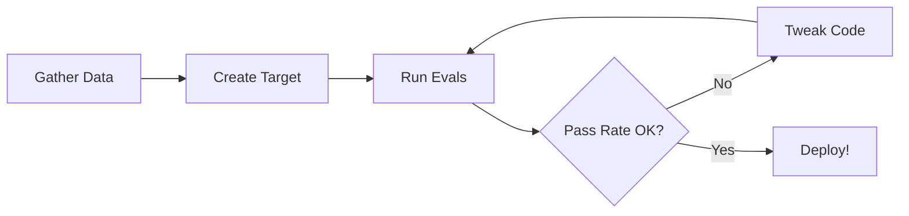

# Evals
## From Caveman Testing to Confident Deployments

  
Cam

  
Senior AI Dev

  
Building agents since DaVinci | Blog writer | Open source contributor

  Andres defined agents → I test & productionize them 
  (agents = workflows here)

---
layout: default
class: slide-2
---

# Life Without Evals

If you're not already doing evals, you're probably doing something like this...

  
📞 Scenario: Phone Directory Agent

  
An agent responsible for giving the correct department phone number out of 10 departments

<v-clicks>

### The Caveman Testing Process:

1. 🖥️ Open your app
2. 🔄 Try a few queries that should trigger the behavior
3. 🔧 Tweak your code/prompt
4. 🔁 Try again to see if it worked
5. 😫 Repeat for multiple test cases

(🔴 Worst case: Having prompts in notepad you copy-paste)

</v-clicks>

---
layout: default
class: slide-3
---

# Why This Sucks

<v-clicks>

  
🐌

  
Slow Iterations

  
Each step is painfully slow

  
📊

  
Low Coverage

  
You can only test a handful of examples

  
🤝

  
Hard to Share

  
Can't easily share findings or track progress

  
🛏️

  
The Short Blanket Problem

  
Cover your neck, feet get cold Cover your feet, neck gets cold

</v-clicks>

  
📈 No Data to Drive Decisions

  
Everything is based on vibes. Can't say "we solve this 95% of the time".

---
layout: center
class: text-center slide-4
---

  There Has Got to Be a Better Way

  What are we looking for?

  Ideally: Run a script and see exactly how often the agent gives the correct phone number

---
layout: default
class: slide-5
---

# Enter Evals

How can we automate that caveman testing process?

## 📝 Minimum Viable Eval

Imagine a script that:
- Takes your list of queries
- Runs them in parallel
- Gives you a table of results

**✨ You're doing evals!**

Already way better than caveman testing

## 🚀 Scale Up Complexity

<v-clicks>

  
Level 1: Check if correct number mentioned

  
Level 2: LLM-as-judge for quality scoring

  
Level 3: Trajectory evals

  
Level 4: Production analysis

</v-clicks>

  
🛠️ Implementation Options:

  

    • LangSmith • Open source frameworks 
    • Testing frameworks (pytest) • Roll your own
  

---
layout: default
class: slide-6
---

# When NOT to Use Evals

Real examples: Some people on Twitter say evals are dead.

## 🎨 Claude Code & NotebookLM

They can get away with it because:

<v-clicks>

  Highly subjective 
  AI podcast quality is hard to measure

  Reliability isn't crucial 
  Users expect some failures

  Strong QA process 
  Thorough dogfooding with tight feedback loops

</v-clicks>

## ⚠️ Our Reality

  
🚫

  
These don't apply to our use case!

  

    Phone numbers need to be correct. 
    Users expect reliability. 
    We can measure success objectively.
  

---
layout: default
class: slide-7
---

# Evals vs Traditional Tests

If you're used to traditional tests, all the same rules apply.

  
Key Differences

  
They complement each other!

<v-clicks>

  
📊 Pass Rates

  

    
Tests: 100% or fail

    
Evals: 90% might be fine

  

  
🎯 Purpose

  

    
Tests: "Are pieces working?"

    
Evals: "When does it fail?"

  

  
⏱️ Timing

  

    
Tests: Every merge, CI

    
Evals: When needed

    
(new model, doc changes)

  

  
💰 Cost & Speed

  

    Evals are expensive and slower than tests
  

</v-clicks>

---
layout: default
class: slide-8
---

# Tips and Tricks

<v-clicks>

  
🎯

  
Test outputs, not implementation

  
Don't test if it used tool X at time Y

  
⚡

  
Evals should be quick

  
Build in hours, not weeks

  
🧪

  
Treat as experiments

  
Test anything: hallucinations, coverage, tools

  
🤖

  
Lean on synthetic data

  
Use strongest model to create diverse examples

  
👀

  
Look at your data

  
Don't trust judges blindly - vibe-check yourself

  
🔧

  
Build reusable components

  
Datasets, targets, evaluators - mix & match

</v-clicks>

  

    ⚡ Pro tip: Test your tools thoroughly - garbage in, garbage out!
  

---
layout: default
class: slide-9
---

# Quick Start - The Stress Testing Flow

<v-clicks>

  
📊

  
1. Gather Data

  <ul class="text-xs space-y-1" style="color: #1a202c !important;">
    <li style="color: #1a202c !important;">• Run 1 question per department</li>
    <li style="color: #1a202c !important;">• Pull from LangSmith traces</li>
    <li style="color: #1a202c !important;">• Generate synthetic examples</li>
  </ul>

  
🎯

  
2. Target Function

  <ul class="text-xs space-y-1" style="color: #1a202c !important;">
    <li style="color: #1a202c !important;">• Simple wrapper for agent</li>
    <li style="color: #1a202c !important;">• Returns output</li>
    <li style="color: #1a202c !important;">• Reuse from other evals</li>
  </ul>

  
🔄

  
3. Evaluate & Iterate

  <ul class="text-xs space-y-1" style="color: #1a202c !important;">
    <li style="color: #1a202c !important;">• Write string match eval</li>
    <li style="color: #1a202c !important;">• Run evals</li>
    <li style="color: #1a202c !important;">• Tweak prompt/code</li>
    <li style="color: #1a202c !important;">• Re-run until satisfied</li>
  </ul>

</v-clicks>

---
layout: center
class: text-center slide-10
---

<h1 class="drop-shadow-lg">Closing Thoughts</h1>

  Evals should be a relief from the pain of Caveman testing

<v-clicks>

  🔧 The Evals modules compound → so start!

  🗑️ There's so many bad AI products out there

  Be confident in yours 💪

</v-clicks>

