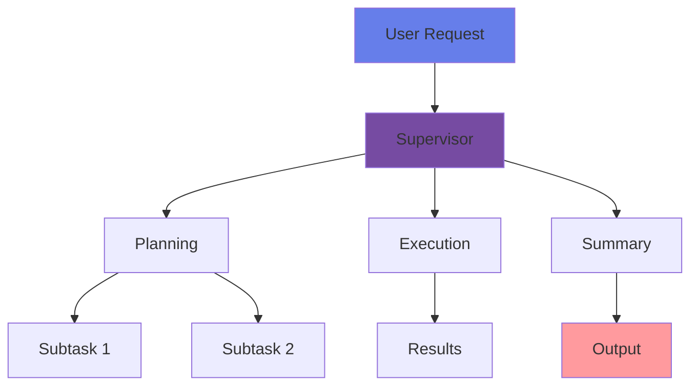

---
layout: center
class: text-white
---

# Complex AI Agents

 

### One dev's super-cool-multi-agent architecture is another dev's tech debt

 
 

  🤖
  🔀
  💻

---
layout: two-cols
class: text-white
---

## The Hype is Real 🚀

<v-clicks>

- **Multi-agent frameworks** everywhere
  - Swarms, supervisors, crews
  - Committees, orchestrators
- **Beautiful vision**: Corporate hierarchy of AI
- **Real benefits**: Benchmarks show improvement

</v-clicks>

::right::

---
layout: center
class: text-white text-center
---

<h1 class="text-6xl font-bold mb-8">
  But here's the thing...
</h1>

  These frameworks are a temporary fix

  A clever workaround for today's limitations

---
layout: default
class: text-white
---

## The Brittle Reality 💔

  

    <h3 class="text-2xl mb-4 gradient-text">Every Agent = Failure Point</h3>
    <ul class="space-y-2">
      <li>• Errors compound exponentially</li>
      <li>• Debugging nightmare</li>
      <li>• High latency</li>
    </ul>
  

  

    <h3 class="text-2xl mb-4 gradient-text">Production Reality</h3>
    <ul class="space-y-2">
      <li>• Few swarms in production</li>
      <li>• Fragile & tough to maintain</li>
      <li>• More nodes = more problems</li>
    </ul>
  

  <carbon-warning class="text-yellow-400 text-3xl inline-block mr-2"/>
  Where are all the successful swarms?

---
layout: default
class: text-white
---

## Software Dev Example 👨‍💻

Today's typical agent workflow:

<v-clicks>

1. **Search/Re-ranking Agent** - Scours repos for relevant files
2. **Planning Agent** - Creates approach & breaks into tasks
3. **Coding Agent(s)** - Writes the actual code
4. **Testing Agent** - Writes and runs tests
5. **PR Agent** - Submits pull request

</v-clicks>

---
layout: default
class: text-white
---

## Why These Steps Exist 🤔

<v-clicks every="1">

  <h3 class="text-base gradient-text">Search & Re-ranking</h3>
  
Context windows too small & expensive

  
→ Context + price improvements = Obsolete

  <h3 class="text-base gradient-text">Planning & Task Breakdown</h3>
  
Smart models direct cheaper models

  
→ Internal planning + output limits = Obsolete

  <h3 class="text-base gradient-text">Separate Testing & PRs</h3>
  
Output token limits force separation

  
→ Feasible today, just expensive!

</v-clicks>

---
layout: center
class: text-white
---

<h1 class="text-5xl font-bold text-center mb-8">
  Imagine a 3-5x improvement in:
</h1>

  

    <carbon-data-vis-4 class="text-5xl mb-4 text-yellow-300"/>
    <h3 class="text-2xl">Context Windows</h3>
  

  

    <carbon-currency-dollar class="text-5xl mb-4 text-green-300"/>
    <h3 class="text-2xl">Pricing</h3>
  

  

    <carbon-document-export class="text-5xl mb-4 text-blue-300"/>
    <h3 class="text-2xl">Output Limits</h3>
  

  Your complex architecture? Gone.

---
layout: two-cols
class: text-white
---

## The Convergence Pattern 📈

<v-clicks>

**Last Year:**
- OpenAI Assistant API launched
- Built-in RAG, web search, memory
- Limited traction for RAG

**Why?**
- RAG was an exact science
- Tiny windows, dumb models
- High hallucination risks
- Fine-tuning obsessively required

</v-clicks>

::right::

<v-clicks>

**Now:**
- Throw in whole documents
- Top K? Make it 20!
- Bigger windows, lower prices
- Caching, better models

</v-clicks>

  <h3 class="gradient-text text-xl mb-3">The Pattern:</h3>
  
Problems vanish overnight with model updates

---
layout: default
class: text-white
---

## The Shelf Life Problem ⏰

  

    <carbon-time class="text-4xl mb-4 text-orange-400"/>
    <h3 class="text-xl font-bold">6 Months</h3>
    
= An eternity in AI

  

  

    <carbon-flash class="text-4xl mb-4 text-yellow-400"/>
    <h3 class="text-xl font-bold">Updates Hit Fast</h3>
    
And they hit hard

  

  

    <carbon-trash-can class="text-4xl mb-4 text-red-400"/>
    <h3 class="text-xl font-bold">3/6 Steps Gone</h3>
    
By year's end

  

  
Why perfect a six-step swarm today

  
when next release collapses it to one prompt?

---
layout: image-right
image: https://developers.elementor.com/docs/assets/img/elementor-placeholder-image.png
class: text-white
---

## The Race Against Time 🏃‍♂️

<v-clicks>

  <h3 class="text-2xl gradient-text">LangChain</h3>
  
Racing against convergence

  <h3 class="text-2xl gradient-text">Crew</h3>
  
Fighting obsolescence

  <h3 class="text-2xl gradient-text">Swarm</h3>
  
Temporary scaffolding

</v-clicks>

  
All racing against the point where raw model power outstrips their utility

---
layout: center
class: text-white
---

## The Smarter Bet 🎯

  

    <carbon-thumbs-down class="text-6xl text-red-400 mb-4 mx-auto"/>
    <h3 class="text-2xl mb-4">Complex Architecture</h3>
    <ul class="text-left space-y-2">
      <li>• Brittle & fragile</li>
      <li>• High maintenance</li>
      <li>• Soon obsolete</li>
    </ul>
  

  

    <carbon-thumbs-up class="text-6xl text-green-400 mb-4 mx-auto"/>
    <h3 class="text-2xl mb-4">Simplicity</h3>
    <ul class="text-left space-y-2">
      <li>• Fewer moving parts</li>
      <li>• Models will improve</li>
      <li>• Future-proof design</li>
    </ul>
  

---
layout: default
class: text-white
---

## The Bottom Line 💡

<v-clicks>

  <carbon-checkmark-outline class="text-3xl text-green-400 float-left mr-4"/>
  
Agent architectures are critical now

  
They squeeze the most out of today's tech

  <carbon-warning-alt class="text-3xl text-yellow-400 float-left mr-4"/>
  
But they're not evergreen

  
They won't last as models improve

  <carbon-idea class="text-3xl text-blue-400 float-left mr-4"/>
  
The best architecture solves with fewest parts

  
Especially when those parts get smarter daily

</v-clicks>

---
layout: cover
class: text-white text-center
---

  <h1 class="text-5xl font-bold mb-8">
    Build for Tomorrow
  </h1>

  

    Not yesterday's limitations
  

  

    

      
Lean on optimism

    

    

      
Embrace simplicity

    

    

      
Models will improve

    

  

  

    
Thank you!

  

